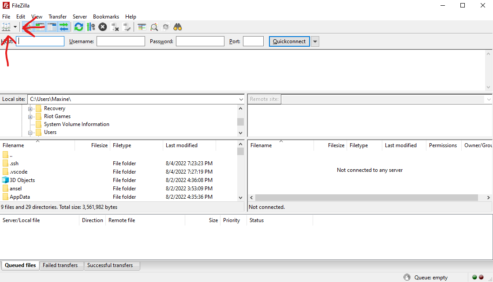
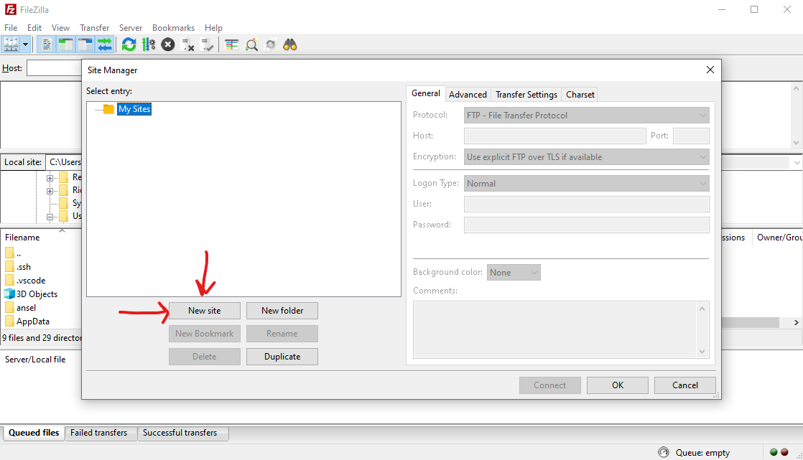
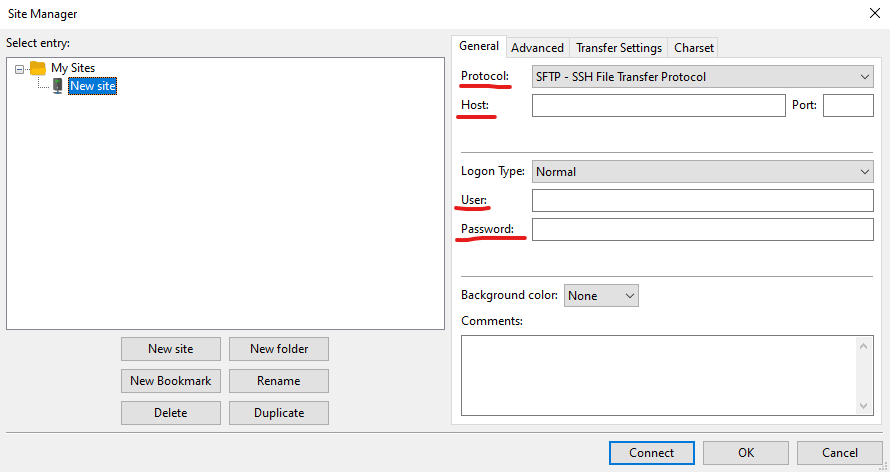

# James' Technology Project Portal
 Welcome! I'm a tech hobbyist in my free time and here I post my current and completed projects.

# Transferring Files from Windows to Linux using SSH, Filezilla, and SFTP.
In this tutorial I will show you how to send files from one computer to another over a network connection.

## Introduction
I recently discovered that My main desktop PC running Windows 11 has bad memory, likely due to an unstable overclock (I tried installing Ubuntu and it gave me hardware memory errors upon booting into the live environment). I had over 200 GB of files to move but no physical media to do so other than a dollar-store-quality usb flash drive. I did some research, and learned of SFTP, or SSH File Transfer Protocol, which enables a user to directly move data from any directory on a computer to another. I hosted an ssh server on my backup linux PC and used the windows program Filezilla to transfer my files via network. Here's how I did it.

## Steps
 I first started on my linux PC running PopOS 22.04 LTS, which uses the APT package manager. 

1. I started by updating my system:
```
sudo apt update && sudo apt upgrade -y
```

2. The next step is to install SSH on the linux system (you may already have it but it's good to check): 
```
sudo apt install ssh
```
3. Next, I enabled ssh on my system:
```
sudo systemctl enable --now ssh
```
4. Next, I checked to make sure the linux firewall won't block an incoming ssh connection from windows by allowing the port used by ssh through the firewall:
```
sudo ufw allow 22/tcp
```
> openssh uses port 22 by default, which is why this is the port we enabled.

5. Before switching to the Windows PC, I made a note of the IP address on the Linux machine:
```
hostname -I | awk '{print $1}'
```
>This command is broken into two parts. `hostname -I` spits out the machine's IP address along with info I don't need, like the MAC address etc. Piping the command into `awk '{print $1}'` gets the first section of output, in this case the IP address.

6. Next, I switched to the Windows PC and installed the program [FileZilla](https://filezilla-project.org/). Follow the installation instructions and launch FileZilla. 

7. In the top left of the main window, right below the "File" tab, click on the button "Site Manager" button.


<!--  -->

 It'll open a new window, with a set of more buttons at the bottom. Click "New Site". 
 
 
 
 On the right, there are 4 boxes that are important. Switch the protocol to SFTP in the dropdown menu. Then add the linux machine IP address in the Host box. Lastly, enter the username and password of the linux machine right below that, then click the connect button.
 
 

  FileZilla will display a warning message saying you should be extra careful that you entered all the info correctly, and if you're sure, check the "Always trust this host, add this key to the cache."

8. At this point, I've connected to my linux pc and have access to the filesystem. 

to be continued. . . . . . . . . 

# PiHole - Network wide Ad Blocker for the home network
